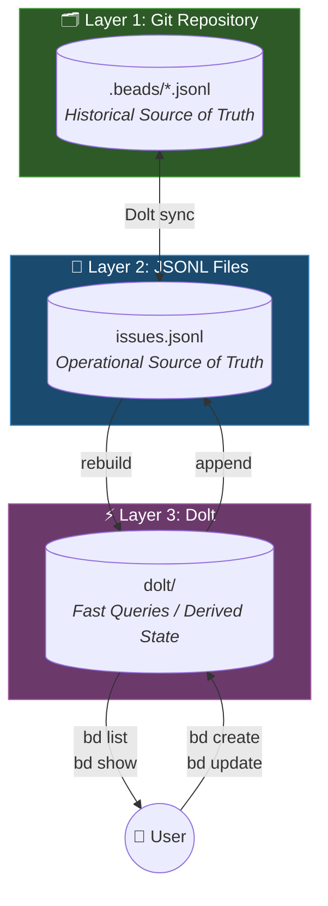

# Architecture Overview

This document explains how Beads' three-layer architecture works: Git, JSONL, and Dolt.

## The Three Layers

Beads uses a layered architecture where each layer serves a specific purpose:



:::info Historical vs Operational Truth
**Git** is the *historical* source of truth—commits preserve the full history of your issues and can be recovered from any point in time.

**JSONL** is the *operational* source of truth—when recovering from database corruption, Beads rebuilds the Dolt database from JSONL files, not directly from Git commits.

This layered model enables recovery: if the database is corrupted but JSONL is intact, run `bd import -i .beads/issues.jsonl` to rebuild. If JSONL is corrupted, recover it from Git history first. Dolt handles synchronization automatically.
:::

### Layer 1: Git Repository

Git is the *historical* source of truth. All issue data lives in the repository alongside your code, with full history preserved in commits.

**Why Git?**
- Issues travel with the code
- No external service dependency
- Full history via Git log (recover any point in time)
- Works offline
- Enables multi-machine and multi-agent workflows

### Layer 2: JSONL Files

JSONL (JSON Lines) files store issue data in an append-only format. This is the *operational* source of truth—Dolt databases are rebuilt from JSONL.

**Location:** `.beads/*.jsonl`

**Why JSONL?**
- Human-readable and inspectable
- Git-mergeable (append-only reduces conflicts)
- Portable across systems
- Can be recovered from Git history
- **Recovery source**: `bd import -i .beads/issues.jsonl` rebuilds Dolt from JSONL

### Layer 3: Dolt Database

Dolt provides fast local queries without network latency, plus native version control. This is *derived state*—it can always be rebuilt from JSONL.

**Location:** `.beads/dolt/`

**Why Dolt?**
- Instant queries (no network)
- Complex filtering and sorting
- Native version control with branching and merging
- Derived from JSONL (always rebuildable)
- Safe to delete and rebuild: `rm -rf .beads/dolt && bd import -i .beads/issues.jsonl`

## Data Flow

### Write Path
```text
User runs bd create
    → Dolt updated
    → JSONL appended
    → Git commit (on sync)
```

### Read Path
```text
User runs bd list
    → Dolt queried
    → Results returned immediately
```

### Sync Path
```text
Dolt handles sync automatically
    → JSONL merged
    → Dolt rebuilt if needed
```

### Sync Modes

:::info
Dolt handles synchronization automatically. The import/export commands remain available for manual data transfer and recovery.
:::

#### Dolt-Native Sync (Current)
Dolt handles bidirectional synchronization automatically. No manual sync command is needed.

#### Manual Import (Recovery)
```bash
bd import -i .beads/issues.jsonl
```
Rebuilds the Dolt database from JSONL. Use this when:
- Database is corrupted or missing
- Recovering from a fresh clone
- Rebuilding after database migration issues

This is the safest recovery option when JSONL is intact.

#### Manual Export
```bash
bd export
```
Exports the Dolt database to JSONL. Use this for manual data transfer or backups.

### Multi-Machine Sync Considerations

When working across multiple machines or clones, Dolt handles synchronization automatically. However:

1. **Dolt syncs automatically** -- no manual sync needed when switching machines

2. **Pull before creating new issues**
   ```bash
   git pull  # Get latest changes
   bd create "New issue"
   ```

3. **Avoid parallel edits** - If two machines create issues simultaneously, conflicts may occur

See [Sync Failures Recovery](/recovery/sync-failures) for data loss prevention in multi-machine workflows (Pattern A5/C3).

## The Daemon

The Beads daemon (`bd daemon`) handles background synchronization:

- Watches for file changes
- Triggers sync on changes
- Keeps Dolt in sync with JSONL
- Manages lock files

:::tip
The daemon is optional but recommended for multi-agent workflows.
:::

### Running Without the Daemon

For CI/CD pipelines, containers, and single-use scenarios, run commands without spawning a daemon:

```bash
bd --no-daemon create "CI-generated issue"
bd --no-daemon export  # Manual export if needed
```

**When to use `--no-daemon`:**
- CI/CD pipelines (Jenkins, GitHub Actions)
- Docker containers
- Ephemeral environments
- Scripts that should not leave background processes
- Debugging daemon-related issues

### Daemon in Multi-Clone Scenarios

:::warning Race Conditions in Multi-Clone Workflows
When multiple git clones of the same repository run daemons simultaneously, race conditions can occur during push/pull operations. This is particularly common in:
- Multi-agent AI workflows (multiple Claude/GPT instances)
- Developer workstations with multiple checkouts
- Worktree-based development workflows

**Prevention:**
1. Use `bd daemons killall` before switching between clones
2. Ensure only one clone's daemon is active at a time
3. Consider `--no-daemon` mode for automated workflows
:::

See [Sync Failures Recovery](/recovery/sync-failures) for daemon race condition troubleshooting (Pattern B2).

## Recovery Model

The three-layer architecture makes recovery straightforward because each layer can rebuild from the one above it:

1. **Lost database?** → Rebuild from JSONL: `bd import -i .beads/issues.jsonl`
2. **Lost JSONL?** → Recover from Git history: `git checkout HEAD~1 -- .beads/issues.jsonl`
3. **Conflicts?** → Git merge, then rebuild

### Universal Recovery Sequence

The following sequence demonstrates how the architecture enables quick recovery. For detailed procedures, see [Recovery Runbooks](/recovery).

This sequence resolves the majority of reported issues:

```bash
bd daemons killall           # Stop daemons (prevents race conditions)
git worktree prune           # Clean orphaned worktrees
rm -rf .beads/dolt/          # Remove potentially corrupted database
bd import -i .beads/issues.jsonl  # Rebuild from JSONL source of truth
```

:::danger Never Use `bd doctor --fix`
Analysis of 54 GitHub issues revealed that `bd doctor --fix` frequently causes **more damage** than the original problem:

- Deletes "circular" dependencies that are actually valid parent-child relationships
- False positive detection removes legitimate issue links
- Recovery after `--fix` is harder than recovery from the original issue

**Safe alternatives:**
- `bd doctor` — Diagnostic only, no changes made
- `bd blocked` — Check which issues are blocked and why
- `bd show <issue-id>` — Inspect a specific issue's state

If `bd doctor` reports problems, investigate each one manually before taking any action.
:::

See [Recovery](/recovery) for specific procedures and [Database Corruption Recovery](/recovery/database-corruption) for `bd doctor --fix` recovery (Pattern D4).

## Design Decisions

### Why not just Dolt?

Dolt alone doesn't travel with Git or merge well across branches. Database files create merge conflicts that are nearly impossible to resolve.

### Why not just JSONL?

JSONL is slow for complex queries. Scanning thousands of lines for filtering and sorting is inefficient. Dolt provides indexed lookups in milliseconds.

### Why append-only JSONL?

Append-only format minimizes Git merge conflicts. When two branches add issues, Git can cleanly merge by concatenating the additions. Edit operations append new records rather than modifying existing lines.

### Why not a server?

Beads is designed for offline-first, local-first development. No server means no downtime, no latency, no vendor lock-in, and full functionality on airplanes or in restricted networks.

### Trade-offs

| Benefit | Trade-off |
|---------|-----------|
| Works offline | No real-time collaboration |
| Git-native history | Requires Git knowledge |
| No server dependency | No web UI or mobile app |
| Local-first speed | Manual sync required |
| Append-only merging | JSONL files grow over time |

### When NOT to use Beads

Beads is not suitable for:

- **Large teams (10+)** — Git-based sync doesn't scale well for high-frequency concurrent edits
- **Non-developers** — Requires Git and command-line familiarity
- **Real-time collaboration** — No live updates; requires explicit sync
- **Cross-repository tracking** — Issues are scoped to a single repository
- **Rich media attachments** — Designed for text-based issue tracking

For these use cases, consider GitHub Issues, Linear, or Jira.

## Related Documentation

- [Recovery Runbooks](/recovery) — Step-by-step procedures for common issues
- [CLI Reference](/cli-reference) — Complete command documentation
- [Getting Started](/) — Installation and first steps
